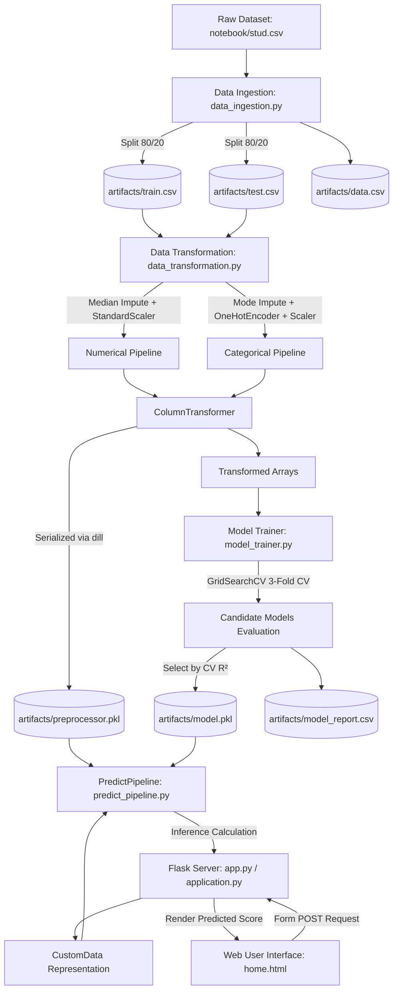

# 🎓 Student Exam Performance Predictor

[](https://www.python.org/)
[](https://flask.palletsprojects.com/)
[](https://scikit-learn.org/)
[](https://aws.amazon.com/elasticbeanstalk/)
[](LICENSE)

An end-to-end production-grade Machine Learning application designed to analyze and predict student academic performance (specifically Mathematics test scores) based on demographic, socioeconomic, and educational indicators. 

The project adheres to modular software engineering principles, featuring automated data ingestion, robust feature transformation pipelines, hyperparameter-tuned model training, custom error tracking and logging, and an interactive Flask web application configured for deployment on AWS Elastic Beanstalk.

---

## 📌 Table of Contents

- [Overview](#-overview)
- [Key Exploratory Data Analysis (EDA) Insights](#-key-exploratory-data-analysis-eda-insights)
- [System Architecture](#-system-architecture)
- [Model Evaluation & Benchmarks](#-model-evaluation--benchmarks)
- [Project Directory Structure](#-project-directory-structure)
- [Pipeline Components](#-pipeline-components)
- [Installation & Setup](#-installation--setup)
- [How to Run the Project](#-how-to-run-the-project)
- [Web Application & Usage](#-web-application--usage)
- [AWS Elastic Beanstalk Deployment](#-aws-elastic-beanstalk-deployment)
- [Future Enhancements](#-future-enhancements)
- [Author & License](#-author--license)

---

## 📖 Overview

Predicting student performance early enables educators and academic counselors to identify at-risk students and design targeted interventions. 

This project explores the **Students Performance in Exams** dataset from Kaggle to determine how demographic factors (gender, race/ethnicity), socioeconomic indicators (lunch type, parental education level), test preparation status, and complementary subject proficiencies (reading and writing scores) correlate with a student's mathematics examination score.

### Target & Feature Specification
- **Target Variable**: `math_score` (Continuous numeric, range `0 – 100`)
- **Numerical Features**: `reading_score`, `writing_score`
- **Categorical Features**: `gender`, `race_ethnicity`, `parental_level_of_education`, `lunch`, `test_preparation_course`

---

## 🔍 Key Exploratory Data Analysis (EDA) Insights

From in-depth bivariate and multivariate analyses conducted in `notebook/EDA Student Performance.ipynb`:

1. **Gender Dynamics**:
   - Female students showed higher average overall scores and excelled notably in reading and writing.
   - Male students achieved higher average scores in mathematics.
2. **Race & Ethnicity Groups**:
   - Students in **Group E** consistently outperformed other groups across all subjects.
   - Students in **Group A** showed lower average scores across subjects, highlighting institutional and socioeconomic opportunity disparities.
3. **Parental Level of Education**:
   - Strong positive correlation between parental educational attainment and student performance: students whose parents hold Master's or Bachelor's degrees achieved the highest composite scores.
4. **Lunch Type as a Socioeconomic Proxy**:
   - Students receiving **Standard Lunch** scored significantly higher (~10–15 points on average) than peers receiving **Free/Reduced Lunch**, serving as a critical proxy indicator for socioeconomic status.
5. **Test Preparation Course**:
   - Completing a test preparation course provided a measurable and statistically significant score boost across all subjects.
6. **Cross-Subject Linear Correlation**:
   - `reading_score` and `writing_score` exhibit strong linear correlation with `math_score` ($r > 0.80$), making them dominant predictive signals in regression modeling.

---

## 🏗 System Architecture

The following diagram illustrates the complete end-to-end data and inference lifecycle:



---

## 📊 Model Evaluation & Benchmarks

`src/components/model_trainer.py` tunes each of the 9 candidate models with `GridSearchCV` (3-fold CV, `scoring='r2'`) on the training split only. **The model is selected by mean 3-fold CV $R^2$**, refit on the full training set, and only then evaluated **once** on the 20% holdout test set, for reporting. Test scores play no part in selection. A model is accepted only if its CV $R^2$ is at least 0.60.

Results from the latest run (`artifacts/model_report.csv`, sorted by CV $R^2$):

| Rank | Model | Best Params | CV $R^2$ (3-fold) | Train $R^2$ | Test $R^2$ | Test RMSE | Test MAE |
| :---: | :--- | :--- | :---: | :---: | :---: | :---: | :---: |
| 🥇 | **Linear Regression** (selected) | `{}` | **0.8664** | 0.8743 | 0.8804 | 5.394 | 4.215 |
| 🥈 | **Support Vector Regressor (SVR)** | `C=1, kernel='linear'` | 0.8656 | 0.8726 | 0.8805 | 5.392 | 4.243 |
| 🥉 | **Gradient Boosting Regressor** | `learning_rate=0.05, n_estimators=128, subsample=0.75` | 0.8498 | 0.8951 | 0.8757 | 5.500 | 4.244 |
| 4 | **CatBoost Regressor** | `depth=6, iterations=100, learning_rate=0.1` | 0.8490 | 0.9071 | 0.8614 | 5.808 | 4.459 |
| 5 | **Random Forest Regressor** | `n_estimators=256` | 0.8312 | 0.9772 | 0.8515 | 6.012 | 4.665 |
| 6 | **AdaBoost Regressor** | `learning_rate=0.5, n_estimators=128` | 0.8257 | 0.8505 | 0.8502 | 6.037 | 4.695 |
| 7 | **XGBoost Regressor** | `learning_rate=0.05, n_estimators=64` | 0.8248 | 0.9287 | 0.8492 | 6.057 | 4.663 |
| 8 | **Decision Tree Regressor** | `criterion='poisson'` | 0.7114 | 0.9997 | 0.7543 | 7.732 | 6.195 |
| 9 | **K-Neighbors Regressor** | `n_neighbors=11, weights='distance'` | 0.6089 | 0.9997 | 0.5807 | 10.101 | 7.961 |

> Tree-based models and CatBoost/XGBoost are not seeded, so their CV scores can shift slightly between training runs. Re-run the pipeline and check `artifacts/model_report.csv` for the current numbers.

### 💡 Why Linear Regression?
Linear Regression had the highest mean 3-fold CV $R^2$ (0.8664), so it was selected and saved to `artifacts/model.pkl`. Its single test-set evaluation gave $R^2$ = 0.8804, RMSE = 5.394 and MAE = 4.215.

- **SVR with a linear kernel** came a very close second (CV $R^2$ 0.8656) and scored marginally higher on the test set (0.8805 vs 0.8804). Picking by test score would have chosen SVR. Because selection uses CV only, the test set stays an unbiased estimate, and a 0.0001 test-set difference is noise. The best SVR kernel was linear, which is consistent with a mostly linear relationship.
- **Tree ensembles overfit the training data**: Random Forest reached train $R^2$ 0.9772 but CV $R^2$ 0.8312, and Decision Tree reached train $R^2$ 0.9997 but CV $R^2$ 0.7114.
- Linear Regression has no hyperparameters to tune and is the cheapest model to serve.

#### Notebook experiments (separate from the pipeline)
`notebook/Model Training student.ipynb` contains earlier exploratory experiments that also tried **Ridge** and **Lasso** regression. Those notebook runs are not part of the training pipeline, do not use this CV-based selection, and are not included in `artifacts/model_report.csv` or the table above.

---

## 📁 Project Directory Structure

```plaintext
Student-Performance-Prediction/
├── .ebextensions/
│   └── python.config              # AWS Elastic Beanstalk WSGI configuration
├── artifacts/
│   ├── data.csv                   # Full raw ingested dataset
│   ├── train.csv                  # Training subset (80%)
│   ├── test.csv                   # Testing subset (20%)
│   ├── preprocessor.pkl           # Fitted ColumnTransformer (numerical + categorical)
│   ├── model.pkl                  # Serialized best trained model (LinearRegression)
│   └── model_report.csv           # Per-model best params, CV R², train/test metrics
├── notebook/
│   ├── stud.csv                   # Original raw dataset
│   ├── EDA Student Performance.ipynb    # Exploratory Data Analysis & visual insights
│   └── Model Training student.ipynb     # Model experimentation & evaluation bench
├── src/
│   ├── __init__.py
│   ├── exception.py               # Custom exception handler detailing file & line numbers
│   ├── logger.py                  # Timestamped logging configuration
│   ├── utils.py                   # Object serialization (dill) & model evaluation logic
│   ├── components/
│   │   ├── __init__.py
│   │   ├── data_ingestion.py      # Ingests raw data and outputs train/test splits
│   │   ├── data_transformation.py # Feature imputing, encoding, and scaling pipelines
│   │   └── model_trainer.py       # GridSearch hyperparameter tuning & model selection
│   └── pipeline/
│       ├── __init__.py
│       ├── train_pipeline.py      # Training pipeline orchestrator
│       └── predict_pipeline.py    # CustomData mapper & inference prediction pipeline
├── templates/
│   ├── index.html                 # Simple landing page
│   └── home.html                  # Input form UI for student attributes & result display
├── .gitignore                     # Git ignored files and directories
├── app.py                         # Development Flask server (debug=True)
├── application.py                 # Production Flask server (for AWS WSGI)
├── requirements.txt               # Project dependencies
├── setup.py                       # Packaging script (editable install)
└── README.md                      # Project documentation
```

---

## ⚙️ Pipeline Components

### 1. Custom Exception Handling (`src/exception.py`)
Provides detailed traceback tracking using `sys.exc_info()`. When an exception occurs anywhere in the pipeline, it captures:
- Exact script filename
- Specific line number where failure occurred
- Raw error message string

### 2. Centralized Logging (`src/logger.py`)
Generates timestamp-formatted log files (`MM_DD_YYYY_HH_MM_SS.log`) inside a `logs/` directory to track execution phases, column transformations, and model scores.

### 3. Data Ingestion (`src/components/data_ingestion.py`)
- Reads raw CSV from `notebook/stud.csv`.
- Creates `artifacts/` folder if not present.
- Exports raw data to `artifacts/data.csv`.
- Performs an 80/20 train-test split (`random_state=42`) and saves `train.csv` and `test.csv`.

### 4. Data Transformation (`src/components/data_transformation.py`)
- **Numerical Pipeline**:
  - `SimpleImputer(strategy='median')`: Handles missing numerical values.
  - `StandardScaler()`: Standardizes feature variance.
- **Categorical Pipeline**:
  - `SimpleImputer(strategy='most_frequent')`: Handles missing categorical entries.
  - `OneHotEncoder(handle_unknown='ignore')`: Converts categorical strings into dummy columns.
  - `StandardScaler(with_mean=False)`: Standardizes encoded matrices without destroying sparsity.
- Bundled into a unified `ColumnTransformer` and serialized using `dill` to `artifacts/preprocessor.pkl`.

### 5. Model Trainer (`src/components/model_trainer.py`)
- Tunes each of the 9 candidate regressors with `GridSearchCV(cv=3, scoring='r2')` on the training set. Every model must have an entry in the `params` dict; `evaluate_models` asserts this, so a name mismatch can't silently fall back to an empty grid.
- Selects the model with the highest mean 3-fold CV $R^2$. The test set is never used for selection.
- Rejects the result if the best CV $R^2$ is below the acceptance threshold (0.60).
- Saves the selected model (refit on the full training set) to `artifacts/model.pkl` and writes per-model metrics (best params, CV/train/test $R^2$, test RMSE/MAE) to `artifacts/model_report.csv`.

### 6. Prediction Pipeline (`src/pipeline/predict_pipeline.py`)
- `CustomData`: Maps HTTP form inputs into a structured pandas DataFrame matching feature column names.
- `PredictPipeline`: Loads `artifacts/preprocessor.pkl` and `artifacts/model.pkl` to transform input features and output numerical predictions.

---

## 💻 Installation & Setup

### Prerequisites
- Python 3.8, 3.9, 3.10, 3.11, 3.12, or 3.13
- Git installed on your local machine
- Anaconda or Python `venv`

### 1. Clone the Repository
```bash
git clone https://github.com/<your-username>/Student-Performance-Prediction.git
cd Student-Performance-Prediction
```

### 2. Create and Activate a Virtual Environment

**Using Conda:**
```bash
conda create -n student_ml python=3.11 -y
conda activate student_ml
```

**Using Python venv (Windows PowerShell):**
```powershell
python -m venv venv
.\venv\Scripts\Activate.ps1
```

**Using Python venv (Linux/macOS):**
```bash
python3 -m venv venv
source venv/bin/activate
```

### 3. Install Dependencies
```bash
pip install --upgrade pip
pip install -r requirements.txt
```
*(This also runs `pip install -e .` via `-e .` in `requirements.txt` to install the `src` package in editable mode).*

---

## 🚀 How to Run the Project

### 1. Run Data Ingestion & Model Training
To execute the complete ingestion, transformation, and training pipeline from scratch:
```bash
python src/components/data_ingestion.py
```
**Expected Output** (the selected model's test $R^2$, printed to the console):
```plaintext
0.8804332983749565
```
The log file in `logs/` records the selection, for example:
```plaintext
Best model selected: LinearRegression with params: {}, CV R2: 0.8664332616940963, test R2: 0.8804332983749565
```
This recreates:
- `artifacts/train.csv`
- `artifacts/test.csv`
- `artifacts/preprocessor.pkl`
- `artifacts/model.pkl`
- `artifacts/model_report.csv`

### 2. Launch the Flask Web Application

**For Local Development:**
```bash
python app.py
```

**For Production / WSGI Simulation:**
```bash
python application.py
```

Open your browser and navigate to:
```
http://localhost:5000/predict
```

---

## 🌐 Web Application & Usage

1. Open `http://localhost:5000/predict` in your browser.
2. Fill out the student parameters:
   - **Gender**: `Male` or `Female`
   - **Race/Ethnicity**: `Group A` to `Group E`
   - **Parental Level of Education**: Select from Associate's, Bachelor's, Master's, High School, etc.
   - **Lunch Type**: `Standard` or `Free/Reduced`
   - **Test Preparation Course**: `None` or `Completed`
   - **Reading Score**: `0 – 100`
   - **Writing Score**: `0 – 100`
3. Click **Predict Math Score**.
4. The predicted score is computed in real-time, rounded to two decimal places, and displayed on the interface.

---

## ☁️ AWS Elastic Beanstalk Deployment

This repository is preconfigured for continuous deployment to **AWS Elastic Beanstalk**.

### WSGI Configuration
The `.ebextensions/python.config` file sets the WSGI entrypoint to `application:application`:
```yaml
option_settings:
  "aws:elasticbeanstalk:container:python":
     WSGIPath: application:application
```

### Deployment Steps (AWS Elastic Beanstalk CLI)
1. **Install the EB CLI**:
   ```bash
   pip install awsebcli
   ```
2. **Initialize EB Application**:
   ```bash
   eb init -p python-3.11 student-performance-app --region us-east-1
   ```
3. **Create an Environment & Deploy**:
   ```bash
   eb create student-performance-env
   ```
4. **Open Application**:
   ```bash
   eb open
   ```
5. **Redeploy Updates**:
   ```bash
   eb deploy
   ```

---

## 🔮 Future Enhancements

- [ ] **Multi-Target Prediction**: Extend pipeline to simultaneously predict math, reading, and writing composite indices.
- [ ] **Automated CI/CD Pipeline**: GitHub Actions workflow to run automated linting, unit tests, and automated AWS / Render deployments.
- [ ] **Containerization**: Add multi-stage `Dockerfile` and `docker-compose.yml` for unified cross-platform deployment.
- [ ] **Model Observability**: Integrate **MLflow** for experiment tracking and **Evidently AI** for data drift monitoring.
- [ ] **Modern UI Refresh**: Update front-end to a responsive TailwindCSS / Next.js application with interactive charts.

---

## 👤 Author & License

- **Author**: Adhiraj Dubey ([adhirajdubey17ad@gmail.com](mailto:adhirajdubey17ad@gmail.com))
- **Maintainer**: Adhiraj Dubey
- **License**: Distributed under the [MIT License](LICENSE). Feel free to use and adapt this project for educational and commercial purposes.

---
⭐ *If you found this repository helpful, don't forget to star it!*
